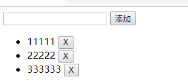

# 事件高级

## 按键修饰符

### 使用 todolist.html 来作为演示范本



### 在输入框输入后点击添加输入框内的内容就添加到列表当中，点击 X 按钮当前的选项就被删除掉

```html
<div id="app">
  <input @keyup.enter.exact="add" type="text" v-model="text" />
  <button @click="add">添加</button> {{text}}
  <ul>
    <li v-for="(item,index) in list">
      {{item}} <button @click="del(index)">X</button>
    </li>
  </ul>
</div>
```

```javascript
var vm = new Vue({
  el: "#app",
  data() {
    return {
      text: "",
      list: [11111, 22222, 333333]
    };
  },
  methods: {
    add: function() {
      this.list.unshift(this.text);
      this.text = "";
    },
    del: function(index) {
      this.list.splice(index, 1);
    }
  }
});
```

### 这里我们使用了@keyup.enter 来监听了键盘事件，当按下回车松开时将输入框内的文本添加到列表当中，而.exact 修饰符允许你控制由精确的系统修饰符组合触发的事件

### 除此之外还有很多按键修饰符，如：

- .enter
- .tab
- .delete (捕获“删除”和“退格”键)
- .esc
- .space
- .up
- .down
- .left
- .right

### 这些都仅仅是一部分，还可用每个按键相对应的数字来代替他们。

## 系统修饰符

### 系统修饰符是作为组合键来存在的，单独的按下并不能触发事件（如：ctrl+）,如果想单独触发事件，只需要将其替换成相应的数字即可

- .ctrl
- .alt
- .shift
- .meta
  > 注意：在 Mac 系统键盘上，meta 对应 command 键 (⌘)。在 Windows 系统键盘 meta 对应 Windows 徽标键 (⊞)。在 Sun 操作系统键盘上，meta 对应实心宝石键 (◆)。在其他特定键盘上，尤其在 MIT 和 Lisp 机器的键盘、以及其后继产品，比如 Knight 键盘、space-cadet 键盘，meta 被标记为“META”。在 Symbolics 键盘上，meta 被标记为“META”或者“Meta”。

## .exact 修饰符

### .exact 修饰符允许你控制由精确的系统修饰符组合触发的事件

```html
<!-- 即使 Alt 或 Shift 被一同按下时也会触发 -->
<button @click.ctrl="onClick">A</button>

<!-- 有且只有 Ctrl 被按下的时候才触发 -->
<button @click.ctrl.exact="onCtrlClick">A</button>

<!-- 没有任何系统修饰符被按下的时候才触发 -->
<button @click.exact="onClick">A</button>
```

## 鼠标按钮修饰符

### 这些修饰符会限制处理函数仅响应特定的鼠标按钮。

- .left
- .right
- .middle

## 事件修饰符

- .stop
- .prevent
- .capture
- .self
- .once
- .passive
- .once

```HTML
<!-- 阻止单击事件继续传播(阻止冒泡事件) -->
<a v-on:click.stop="doThis"></a>

<!-- 提交事件不再重载页面(阻止默认事件) -->
<form v-on:submit.prevent="onSubmit"></form>

<!-- 修饰符可以串联 -->
<a v-on:click.stop.prevent="doThat"></a>

<!-- 只有修饰符 -->
<form v-on:submit.prevent></form>

<!-- 添加事件监听器时使用事件捕获模式 -->
<!-- 即元素自身触发的事件先在此处理，然后才交由内部元素进行处理 -->
<div v-on:click.capture="doThis">...</div>

<!-- 只当在 event.target 是当前元素自身时触发处理函数(点击自身触发) -->
<!-- 即事件不是从内部元素触发的 -->
<div v-on:click.self="doThat">...</div>

<!-- 点击事件将只会触发一次 -->
<a v-on:click.once="doThis"></a>
```

> 使用修饰符时，顺序很重要；相应的代码会以同样的顺序产生。因此，用  
> v-on:click.prevent.self 会阻止所有的点击，而  
> v-on:click.self.prevent 只会阻止对元素自身的点击。
