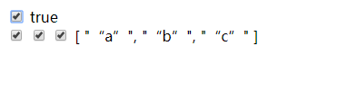

# 此章节为vue_commands中v-model命令的补充章节
## v-model的修饰符
## .lazy
### 当目标失去焦点后执行双向绑定，如果没有失去焦点则不执行
```html
<div id="app">
    <input type="text" v-model.lazy="text">
    {{text}}
</div>
```
```javascript
var vm = new Vue({
    el : "#app",
    data() {
        return {
            text:"hello"
        }
    }
})
```
## .trim
### 自动过滤用户输入的首尾空白字符，不让其传到数据里面
```html
<div id="app">
    <input type="text" v-model.trim="text">
    {{text}}
</div>
```
```javascript
var vm = new Vue({
    el : "#app",
    data() {
        return {
            text:"hello"
        }
    }
})
```
## .number 
### 自动将用户输入的数据类型转换为数值，双向板顶默认输入的是字符串类型
```html
<div id="app">
    <input type="text" v-model.number="number">
</div>
```
```javascript
var vm = new Vue({
    el : "#app",
    data() {
        return {
            number : 20
        }
    }
})
```
## 除了在text框进行双向绑定以外，v-model还可以再以下的标签内进行双向绑定
## 单选&&多选
```html
<div id="app">
    <input type="checkbox" v-model="show">
    {{show}}<br>
    <input type="checkbox" v-model="list" value=“a”>
    <input type="checkbox" v-model="list" value=“b”>
    <input type="checkbox" v-model="list" value=“c”>
    {{list}}<br>
</div>
```
```javascript
var vm = new Vue({
    el: "#app",
    data() {
        return {
            show: true,
            list: [],
        }
    }
})
```

## 下拉列表
```html
<div id="app">
    <select v-model="sel">
        <option value="a">aaaa</option>
        <option value="b">bbbb</option>
        <option value="c">cccc</option>
    </select>
    {{sel}}
</div>
```
```javascript
var vm = new Vue({
    el : "#app",
    data() {
        return {
            sel: "c"
        }
    }
})
```
